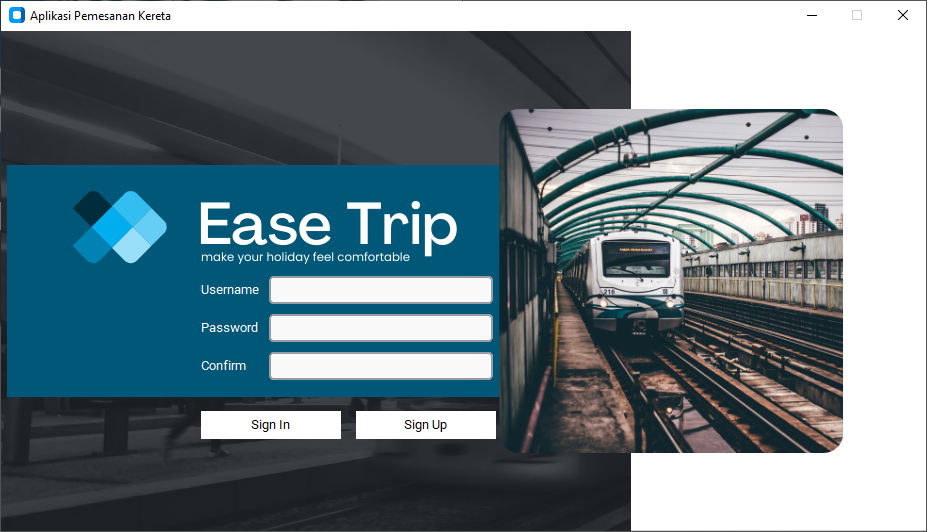
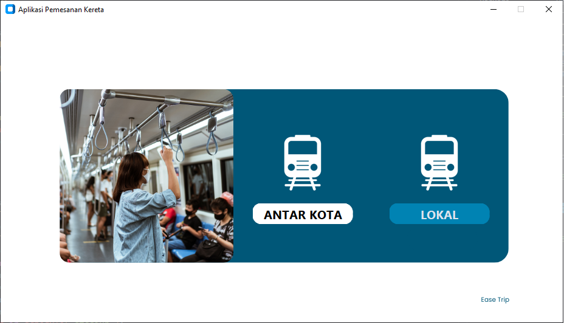

# Aplikasi Pemesanan Kereta

| Page          |                               Image                               |
| ------------- | :---------------------------------------------------------------: |
| Sign In       |    </img>     |
| Sign Up       |    </img>     |
| Welcome       |    </img>    |
| Home          |     </img>      |
| Order Ticket  |     </img>     |
| Add Penumpang | </img> |
| Pilih Kereta  | </img>  |
| Pilih Kursi   |  </img>  |
| Detail Order  | </img>  |
| Pembayaran    |  </img>   |
| Tickets       |     </img>     |

## Installasi

```bash
git clone https://github.com/SukunDev/aplikasi-pemesanan-kereta.git
cd aplikasi-pemesanan-kereta
python -m venv .venv
source .venv/scripts/activate
pip install -r requirements.txt
```

## Migrating Database

```bash
python seeder.py
```

## Runing Program

```bash
python main.py
```
